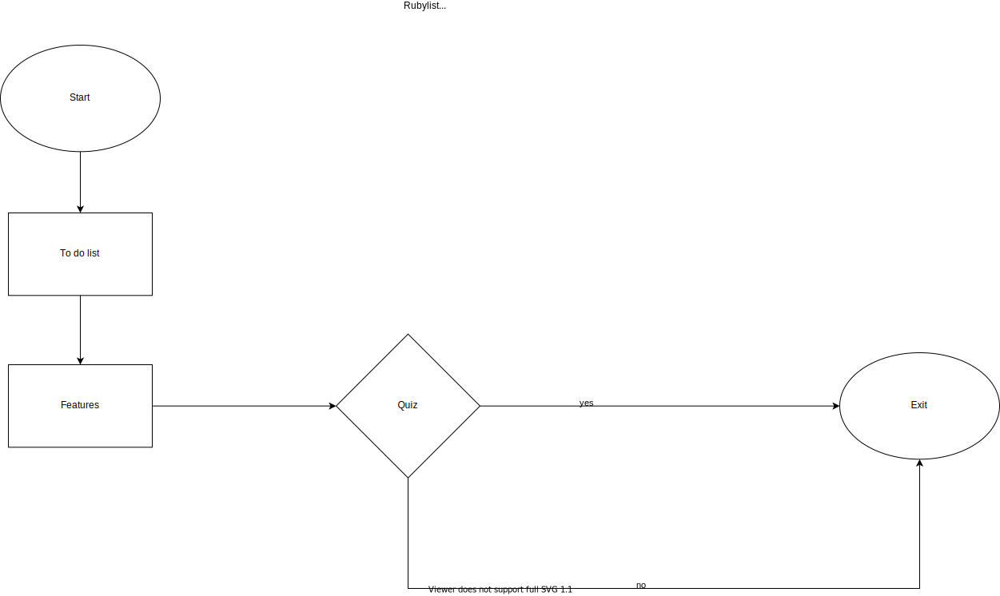
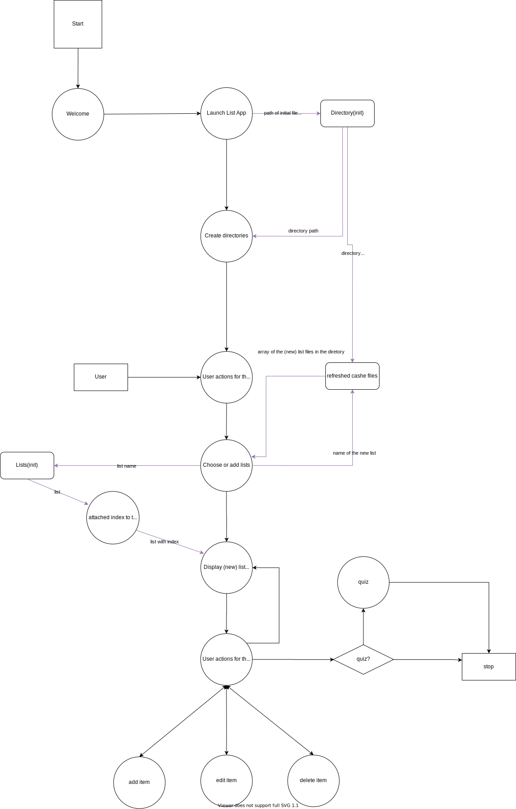
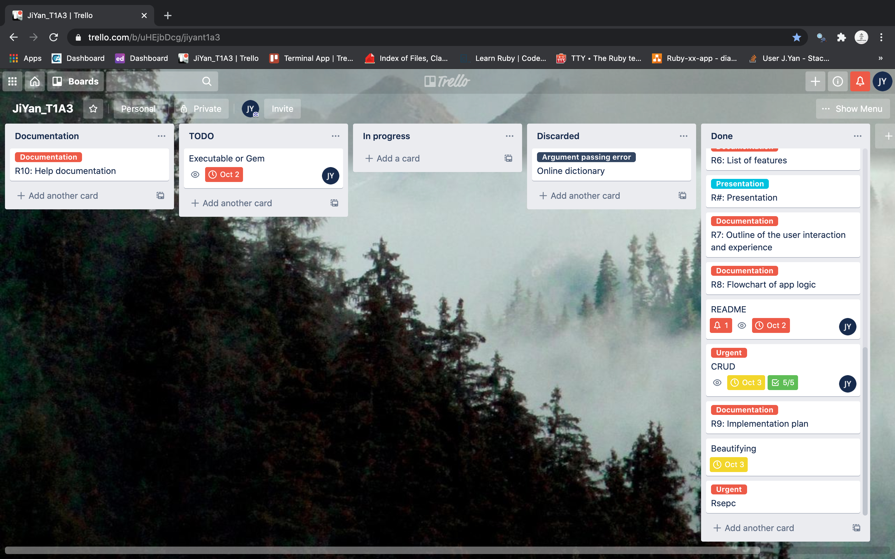

# Software Development Plan - Rubylist

## Purpose and Scope

Rubylist is an interactive to-do-list-based application to help users organise and manage learning tasks and study plans. It has a simple and neat structure for users to navigate through different functionalities and is therefore easy to use without fail. 

Obviously, people today have much more diverse lifestyles to choose from than ever before. However, a problem comes to their attention that that the study loads or workload grow correspondingly, and many find themselves struggling oftentimes for multiple reasons. Certainly, the modern-day technology world has come up with a huge variety of fantastic applications for those who wish to handle schedules effectively and gracefully, yet many of the apps are seemingly less user-friendly despite their sophistication. In that regard, Rubylist was developed in hopes of going back to the nature of task management and providing users a more direct and succinct way to achieve that goal. 

Rubylist should be also a handy tool for users, particularly non-English speaking CS students and software developers. They are accustomed to the command-line interface and work with it on a daily basis, but fail to find off-hour motivation to learn the essential natural language in which the vast majority of tech documents are written. Overall, Rubylist can be seen as a good combination of daily tasks, vocabulary builders, notebooks and many more to be discovered by the users themselves.

## Features

The features included in the application are：

- The to-do list feature is the where the application is based. Overall, the easily accessible task management and organising system present content in a table format with titles, numbers and specific details of what users store in the app. 
- Basic CRUD functions were included, where multiple list creation (editing and deletion disabled for the time being) as well as read, write and delete options for list items are enabled. A local directory is also provided to store local files with regards to user input. An 'until loop' and 'case when' loop are in control of dispatching user instructions and delivering requested data to ensure a functioning data flow, and the directory modules list module are responsible for their own attributes and behaviour respectively to practice 'DRY' . 
- A quiz feature is included to gather user feedback. Four questions were designed in the form of multiple choice questions to pinpoint what users think of and how they feel about the application. From a user experience point of view, despite the possibility of a prior user investigation, due to certain difficulties it is only large corporations that are able to achieve an extensive and accurate estimation by wide-ranging marketing research. For small businesses, sole development teams or even sole developers, it only adds to costs in the traditional sense, and therefore a much better way is let users discover the flaws. At the same time, users are able to interact with developers via emails, and the reason for this is that it is often the case people write emails in a rigorous attitude where senseful thinking facilitates tech issues gathering. 

## User Interaction and Experience

When the application is initialised, users will be greeted with the logo of application. The display of name input comes after, followed by the main to-do list feature. When users get into the to-do list phase, a table of the list files shows up, users can see the title of the table, file indices and names. Then users can proceed with adding, or press any key to go ahead first before they exit the program. When the program receives anything else, the app waits until a valid input comes through.(Technical issues with intended response yet to be solved)

As soon as users select a certain list, they proceed to the next level and are able to view, add, edit and delete the content in it. When adding a new item to the list, only the new content needs to be typed in, followed by a update prompt. When it comes to editing and deleting a certain item, the index needs to come along, otherwise users will be prompted to use a correct syntax with an index next to the user action. If the index points to an unavailable item, they will also be prompted. Whenever user instructions are responded to correctly, same update message will appear. If a user needs to view the general information of list files, they can go back to the initial interface. If they finish their input, they can simply opt out without the need to go back since it is the only way out. 

When entering the quiz phase, users may just exit the program entirely, or choose to proceed and finish the multiple choice questions, and then exit the program. When wrong input is sent through, they will be redirected to the last visited page.

## Flow Charts

### Control Flow

### Data Flow

## Implementation Plan

https://trello.com/b/uHEjbDcg/jiyant1a3

## Help Document

Compatible with Windows, MacOS and Linux

Fork and clone the repo to your desktop, navigate to `rubylist/src/lib/` to run `rubylist.rb`

requried gems: 

    gem "colorize", "~> 0.8.1"
    
    gem "tty-prompt", "~> 0.22.0"
    
    gem "terminal-table", "~> 1.8.0"

or refer to https://github.com/jacinyan/rubylist-installation for installation details.
